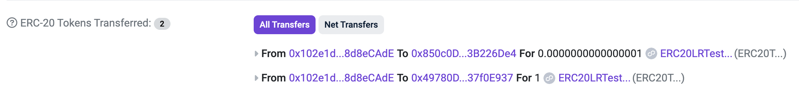

## Cross Chain Batched Wallet - A smart wallet that allows you to batch gasless cross chain transactions using ERC4337, Sygma's Cross Chain SDK & StackUp's Paymaster

Batched Crosschain Wallet consists of:

-  **BatchedWallet.sol** - creates a batchedwallet (ERC4337 Smart Account) per user
-  **BatchedWalletFactory.sol** - factory for generating smart accounts
-  **Index.ts** - script that allows you to perform gasless transactions on Polgon Mumbai Testnet such as erc20 token transfer and batch transfers

## Design Decisions
- Followed eth-infinitism's account abstraction implementation for the SmartAccount and SmartAccountFactory and used a smart contract factory that I deployed a month ago
- For interacting with the smart contracts, used Stackup's userop.js SDK as the code was significantly less than eth-infinitism's SDK
- used Stackup's Paymaster for expediency as a paymaster requires not only a smart contract but an endpoint to respond to requests
- used Stackup's EntryPoint smart contract
- Sygma's SDK was used for the token approvals and for generating the desitnation data for sending to the deposit contract on the Mumbai Bridge
- There's a wallet that already has testnet tokens that has been used to donate testnet tokens to the smart wallet

## Usage

### Running gasless batch transactions with your own smart wallet
#### Install
```bash
$ yarn install 
```

#### Populate Environment
To run the script, `index.ts`, go the folder, `walletScripts`
```bash
$ cd walletScripts
``` 
Create a file named, `.env`, copy the contents of `.env.example` and replace the fields with their values.

#### Run the script
```bash
$ ts-node index.ts
```

#### View the transactions
You'll see the transactions on the Polygon Mumbai testnet.
https://mumbai.polygonscan.com/
Copy the hashes that was output from this script.

Here's an example Batched Transaction

[Sygma Explorer](https://scan.test.buildwithsygma.com/transfer/0x7af02cb4fb4055e44b627e0c1d77b25a05f5bc90ab424f5d30ba84882a1ec0f0)
<br/>
<br/>


### Running smart contract tests using forge
#### Navigate to the contracts directory via terminal
Go to the contracts directory
```bash
$ cd contracts
``` 

Run the tests
```bash
$ forge test --summary
```


<br/>
<br/>

### Deploying your own wallet factory using the code
#### Navigate to the contracts directory via terminal
Go to the contracts directory
```bash
$ cd contracts
``` 

#### Populate Environment
Create a file named, `.env`, copy the contents of `.env.example` and replace the fields with their values.
Feel free to use the privatekey that you attained in the previous steps. But you must first fund it with testnet matic tokens.
Try mumbaifaucet.com. 

#### Run the script to deploy the test erc20 contract
```bash
$ forge script script/BatchedWalletFactory.s.sol --rpc-url $MUMBAI_RPC_URL --broadcast -vvv
```

#### Testing this new walletfactory in walletScripts
Navigate to the Wallet Scripts directory and replace the contract adress from this deployment with the factory Contract address on line 28